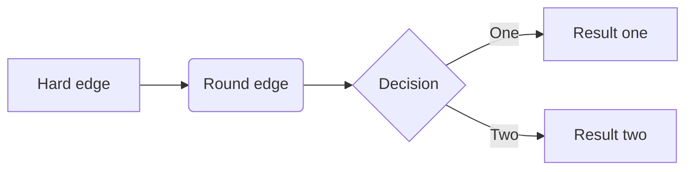
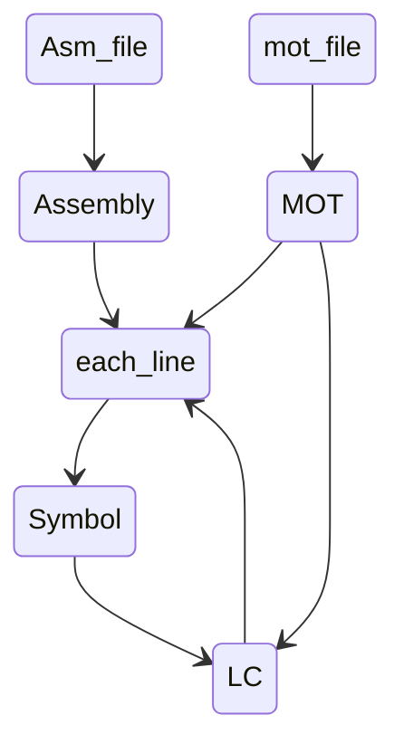

```mermaid
graph LR
A[Hard edge] -->B(Round edge)
    B --> C{Decision}
    C -->|One| D[Result one]
    C -->|Two| E[Result two]
```

```mermaid

 stateDiagram
Asm_file -->Assembly
mot_file --> MOT
Assembly --> each_line 
MOT --> each_line
each_line --> Symbol
MOT --> LC
 LC  -->each_line
Symbol --> LC

```